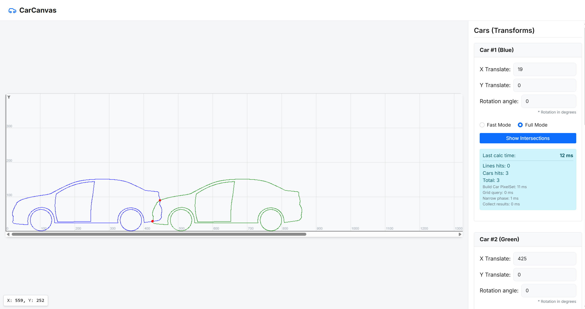

# CarCanvas



CarCanvas is a specialized Proof-of-Concept (PoC) for real-time computational geometry, built with **Blazor WebAssembly** and **HTML5 Canvas**. It visualizes intersection detection between complex rasterized shapes (cars) and large sets of vector lines (up to 300,000 objects), demonstrating performance optimization strategies in a single-threaded browser environment.

## Key Features

*   **Two-Phase Intersection Detection**: Combines **Uniform Grid** spatial indexing (Broad Phase) with **Bresenham/Liang-Barsky** algorithms (Narrow Phase) for efficient collision checks.
*   **Pixel-Perfect Precision**: Detects collisions based on the exact rasterized shape of the car, not just bounding boxes.
*   **Render Decimation**: Automatically simplifies rendering for large scenes (>50k lines) to maintain UI responsiveness ("300k mode").
*   **Anti-Queue UX**: Implements **Debouncing** (100ms) and **Cancellation Tokens** to prevent calculation backlogs during rapid UI interactions.
*   **Real-Time Telemetry**: Tracks granular performance metrics: `GridBuildMs`, `RenderMs`, and `TotalCalcMs`.
*   **Dual Execution Modes**: Supports **Fast Mode** (Early Stop) for quick checks and **Full Mode** for complete statistical analysis.

## Tech Stack

*   **.NET 8**
*   **Blazor WebAssembly** (Client-side execution)
*   **HTML5 Canvas 2D** (via optimized JS Interop with batching)
*   **Docker & Nginx** (Production-ready containerization)

## Getting Started

### Prerequisites
*   .NET SDK 8.0+
*   Docker Desktop (optional, for containerized execution)

### Option 1: Running Locally (Development)

```bash
dotnet restore
dotnet build
dotnet run --project src/CarCanvas.Web/CarCanvas.Web.csproj
```
*The application will start at `http://localhost:5228` (check console output).*

### Option 2: Running via Docker

The repository includes a multistage `Dockerfile` and Nginx configuration for a production-like environment.

```bash
docker compose up --build -d
```
*Access the application at `http://localhost:8080`.*

## Quality Assurance

The project employs a multi-level testing strategy to ensure algorithmic correctness and stability under load.

### Running Tests
Execute the full test suite via .NET CLI:

```bash
dotnet test
```

To run specific test categories (e.g., only invariant checks for algorithmic correctness):

```bash
# Run only invariant tests (Grid vs Brute-force verification)
dotnet test --filter "FullyQualifiedName~Invariants"
```

### Interpreting Results
*   **Passed**: Confirms that the optimized Uniform Grid algorithm produces **identical results** to the naive Brute-force approach (Invariant held).
*   **Failed**: Indicates a divergence in intersection logic or a regression in coordinate transformations.

### Test Scope
*   **Unit Tests**: Verify core geometric algorithms (`Bresenham`, `Liang-Barsky`) and coordinate transformations.
*   **Invariant Tests**: Validate optimization integrity by comparing `UniformGridIndex` results against a brute-force reference implementation (`Optimized == Naive`).
*   **Randomized Fuzzing**: Stress-tests the intersection engine with auto-generated edge cases (degenerate lines, boundary conditions) to detect unhandled exceptions and infinite loops.

## Quick Sanity Check

1.  **Launch the App**: Open the browser (localhost:5228 or localhost:8080).
2.  **Generate Scene**: Click the "Generate 10k" (or "300k") button in the "Lines" panel.
3.  **Verify Rendering**:
    *   For 10k: Lines should appear normally.
    *   For 300k: Look for the **"Render simplified"** badge in the UI.
4.  **Visualize Intersections**: Click the "Show Intersections" button.
5.  **Check Metrics**: Observe `TotalCalcMs` and `NarrowPhaseMs` in the "Metrics" panel.
6.  **Debug Overlay**: Toggle "Show Debug Boxes" to visualize the Uniform Grid cells and AABB.
7.  **Test Responsiveness**: Rotate the car using the slider; verify that the UI remains responsive and metrics update without freezing.

## Documentation

For a deep dive into the architecture, algorithms, and engineering trade-offs, please refer to the [TECHNICAL_REVIEW.md](./TECHNICAL_REVIEW.md).
